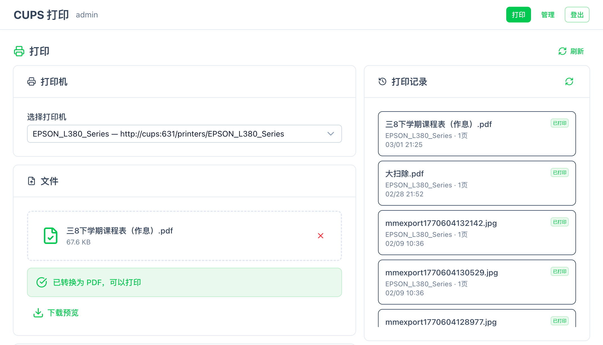
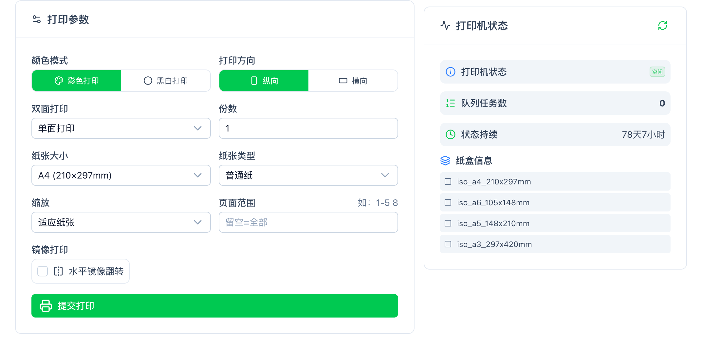
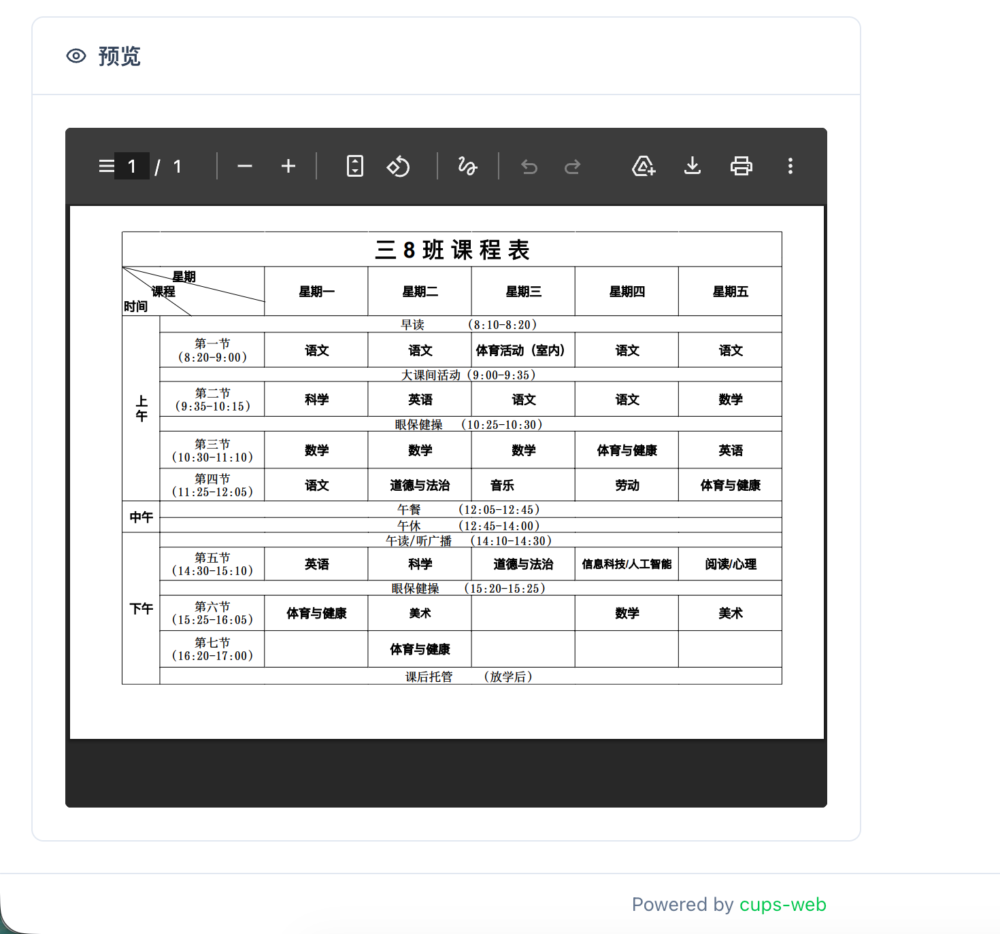

# 🖨️ CUPS Web - 网页打印机

[](https://hub.docker.com/r/hanxi/cups-web)
[](https://github.com/hanxi/cups-web)
[](LICENSE)

这是一个功能完善的网页版打印机管理工具。它允许你通过浏览器远程控制打印机，支持多用户管理、打印记录追踪等功能，轻松实现家庭或小型办公室的打印管理需求。

## 📸 界面预览

<div align="center">

<table>
  <tr>
    <td align="center">
      <br/>
      <b>文件上传</b>
    </td>
    <td align="center">
      <br/>
      <b>打印机</b>
    </td>
  </tr>
  <tr>
    <td align="center">
      <br/>
      <b>预览</b>
    </td>
    <td align="center">
      <br/>
      <b>管理后台</b>
    </td>
  </tr>
</table>

</div>

## ✨ 功能特点

### 核心功能
- **远程打印**：随时随地通过网页上传文件进行打印
- **柔和圆角 UI**：登录、打印台和管理后台采用统一的玻璃卡片和圆角布局
- **打印工作台增强**：支持页数估算、打印预设、单双面模式切换、历史筛选、任务号复制、重打与取消
- **队列状态更真实**：打印记录会区分排队中、处理中、已打印、失败和已取消，不再把“已提交”直接当成“已打印”
- **失败原因可见**：打印失败、取消和设备端状态变化会写入状态说明，便于快速排障
- **问题聚类筛选**：用户和管理员都可以按失败原因、排队超时、处理中超时一键聚焦异常任务
- **多格式支持**：
  - PDF 文档
  - 图片文件（JPG、PNG、GIF）
  - Office 文档（docx、xlsx、pptx 等）自动转换为 PDF（基于 LibreOffice）
  - 文本文件（txt）自动转换为 PDF

### 用户管理
- **多用户系统**：支持管理员和普通用户两种角色
- **打印记录**：完整的打印历史记录
- **账户自助维护**：普通用户可自行修改密码并下载自己提交的原始文件
- **首次改密约束**：管理员重置过密码的用户，首次登录后必须先修改密码

### 管理后台
- **用户管理**：创建、编辑、删除用户账号
- **打印记录查询**：按用户、时间范围查询打印记录
- **CSV 导出**：管理员可导出筛选后的打印记录
- **密码状态可见**：管理员可看到哪些账号仍处于“待改密”状态
- **任务操作闭环**：管理员可对活动任务执行取消，也可对历史任务执行重打
- **活动任务自动刷新**：管理后台检测到排队或处理中任务时，会自动刷新记录状态
- **问题聚类视图**：管理后台会按失败原因和长时间未变化的任务生成快捷筛选
- **系统设置**：配置数据保留天数等

### 安全特性
- **Session 认证**：安全的会话管理机制
- **CSRF 保护**：防止跨站请求伪造攻击
- **密码加密**：使用 bcrypt 加密存储用户密码
- **首启无默认口令**：首次部署通过网页向导直接设置管理员密码，避免再依赖 `admin / admin`

### 部署优势
- **拉镜像即可启动**：Web 镜像可直接运行，首次访问时由网页端引导完成初始化
- **Docker Compose 仍可选**：如果你同时部署 CUPS 容器，向导会直接接管后续配置
- **数据持久化**：数据库和上传文件独立存储
- **易于维护**：简洁的配置和管理界面

## 🛠️ 技术栈

- **打印服务**: [CUPS](https://github.com/OpenPrinting/cups)
- **后端**: Go
- **前端**: Vue 3 + Nuxt UI + Tailwind CSS 4

## 🔧 本地构建

推荐直接使用 Makefile，一次完成前端构建和带嵌入资源的后端编译：

```bash
make build
```

`make build` 会优先使用 Bun；若 Bun 安装失败，会自动回退到 `npm ci`。

手动构建时，请先构建前端，再使用嵌入标签编译 Go 服务：

```bash
cd frontend
bun install --frozen-lockfile
bun run build

cd ..
go build -tags frontend_dist -o bin/cups-web ./cmd/server
```

如果本机没有 Bun，也可以使用 npm：

```bash
cd frontend
npm ci
npm run build
```

仓库中的 `frontend/` 带有独立 `go.mod` 边界，用于避免 `go test ./...` 扫描 `node_modules`。

## 🚀 快速开始

### 前置要求

- Docker
- 一个可访问的 CUPS 服务

### 1. 直接运行 Web 镜像

如果你已经有可用的 CUPS 服务，这是最简单的启动方式：

```bash
docker pull hanxi/cups-web:latest
docker run -d \
  --name cups-web \
  -p 1180:8080 \
  -v cups-web-data:/data \
  -v cups-web-uploads:/uploads \
  hanxi/cups-web:latest
```

启动后直接访问：

```text
http://localhost:1180/#/setup
```

网页会引导你完成下面几件事：

1. 输入 CUPS 地址，例如 `host.docker.internal:631`、`192.168.1.20:631` 或 `cups:631`
2. 测试连接并确认能读到打印机
3. 设置管理员密码
4. 选择记录保留天数
5. 完成初始化并自动进入系统

### 2. 如果你也想同时跑 CUPS 容器

仍然可以使用 `docker-compose.yml`。它现在只负责拉起容器，真正的初始化交给网页向导：

```yaml
services:
  cups:
    image: docker.1ms.run/hanxi/cups:latest
    user: root
    environment:
      - CUPSADMIN=${CUPSADMIN}
      - CUPSPASSWORD=${CUPSPASSWORD}
    ports:
      - "631:631"
    devices:
      - /dev/bus/usb:/dev/bus/usb
    volumes:
      - ./.etc:/etc/cups
    restart: unless-stopped

  web:
    image: docker.1ms.run/hanxi/cups-web:latest
    user: root
    environment:
      - CUPS_HOST=cups:631
    volumes:
      - ./.data:/data
      - ./.uploads:/uploads
    ports:
      - "1180:8080"
    depends_on:
      - cups
    restart: unless-stopped
```

启动：

```bash
docker-compose up -d
```

然后访问 `http://localhost:1180/#/setup`，向导里会默认带上 `cups:631`。

### 3. 开始使用

1. 在向导中完成初始化
2. 进入管理后台创建普通用户账号
3. 用户即可登录并开始打印

## 📖 详细使用指南

### 用户角色说明

#### 管理员（Admin）
- 管理所有用户账号
- 查看所有打印记录
- 配置系统设置（数据保留等）
- 访问管理后台

#### 普通用户（User）
- 上传并打印文件
- 查看个人打印历史

### 打印功能

#### 支持的文件格式

| 格式类型 | 支持的扩展名 | 说明 |
|---------|------------|------|
| PDF | `.pdf` | 直接打印 |
| 图片 | `.jpg`, `.jpeg`, `.png`, `.gif` | 自动转换为 PDF |
| Office | `.docx`, `.xlsx`, `.pptx`, `.doc`, `.xls`, `.ppt` | 通过 LibreOffice 转换为 PDF |
| 文本 | `.txt` | 自动转换为 PDF |

#### 打印流程

1. **选择打印机**：从列表中选择可用的打印机
2. **上传文件**：点击选择文件按钮上传要打印的文件
3. **预览和转换**：
   - PDF 和图片可直接预览
   - Office 文档可点击"转换"按钮预览转换后的 PDF
4. **查看页数估算**：系统自动显示预估页数
5. **确认打印**：点击"打印"按钮提交打印任务

#### 打印记录

用户可以查看自己的打印历史，包括：
- 打印时间
- 文件名
- 页数
- 打印状态
- 纸张、方向、缩放、页码范围等关键参数
- 状态说明（如失败原因、设备处理中说明、用户取消说明）

### 管理后台使用

#### 用户管理

**创建用户：**
1. 进入管理后台
2. 点击"创建用户"
3. 填写用户信息：
   - 用户名（必填）
   - 密码（必填）
   - 角色（管理员/普通用户）
   - 联系信息（可选）
4. 新建用户首次登录时需要先修改密码

**编辑用户：**
- 可修改用户的所有信息（除用户名外）
- 管理员重置用户密码后，该用户会重新进入“待改密”状态

**删除用户：**
- 可删除普通用户
- 默认管理员账号（admin）受保护，无法删除

#### 打印记录查询

管理员可以：
- 查看所有用户的打印记录
- 按用户名筛选
- 按时间范围筛选
- 导出打印记录（查看详细信息）

#### 系统设置

**数据保留天数：**
- 设置打印记录和上传文件的保留时间
- 超过保留期的数据会被自动清理

## ⚙️ 配置说明

### 环境变量详解

#### Web 服务配置

| 变量名 | 说明 | 默认值 | 必填 |
|--------|------|--------|------|
| `LISTEN_ADDR` | Web 服务监听地址 | `:8080` | 否 |
| `DB_PATH` | SQLite 数据库文件路径 | `/data/cups-web.db` | 否 |
| `UPLOAD_DIR` | 上传文件存储目录 | `/uploads` | 否 |
| `CUPS_HOST` | 首次部署时向导默认展示的 CUPS 地址 | `localhost:631` | 否 |
| `SESSION_HASH_KEY` | Session 加密哈希密钥，不填时自动生成 | 自动生成 | 否 |
| `SESSION_BLOCK_KEY` | Session 加密块密钥，不填时自动生成 | 自动生成 | 否 |
| `SESSION_SECURE` | 是否启用 HTTPS Cookie | `false` | 否 |

#### CUPS 服务配置

| 变量名 | 说明 | 默认值 | 必填 |
|--------|------|--------|------|
| `CUPSADMIN` | CUPS 管理员用户名 | - | **是** |
| `CUPSPASSWORD` | CUPS 管理员密码 | - | **是** |

### Docker Compose 配置

默认的 `docker-compose.yml` 配置：

- **CUPS 服务端口**：`631`（用于管理打印机）
- **Web 服务端口**：`1180`（用于访问 Web 界面）
- **数据持久化**：
  - `./.data`：数据库文件
  - `./.uploads`：上传的文件
  - `./.etc`：CUPS 配置文件

### 修改端口

如需修改端口，编辑 `docker-compose.yml`：

```yaml
services:
  web:
    ports:
      - "你的端口:8080"  # 修改左侧端口号
```

## 🔧 高级配置

### 使用 HTTPS

1. 在 `.env` 中设置：
```bash
SESSION_SECURE=true
```

2. 配置反向代理（如 Nginx）处理 HTTPS：

```nginx
server {
    listen 443 ssl;
    server_name your-domain.com;

    ssl_certificate /path/to/cert.pem;
    ssl_certificate_key /path/to/key.pem;

    location / {
        proxy_pass http://localhost:1180;
        proxy_set_header Host $host;
        proxy_set_header X-Real-IP $remote_addr;
        proxy_set_header X-Forwarded-For $proxy_add_x_forwarded_for;
        proxy_set_header X-Forwarded-Proto $scheme;
    }
}
```

### 数据备份

定期备份以下目录：

```bash
# 备份数据库
cp ./.data/cups-web.db /backup/location/

# 备份上传文件
tar -czf uploads-backup.tar.gz ./.uploads/

# 备份 CUPS 配置
tar -czf cups-config-backup.tar.gz ./.etc/
```

### 性能优化

对于大量用户场景，建议：

1. 增加 Docker 容器资源限制
2. 定期清理过期的打印记录和文件
3. 使用 SSD 存储数据库文件

## ⚠️ 注意事项

### 安全建议

1. **初始化时直接设置强密码**：向导会创建管理员，不再使用默认口令
2. **生产环境固定会话密钥**：多实例或长期部署时，建议显式设置 `SESSION_HASH_KEY` 和 `SESSION_BLOCK_KEY`
3. **启用 HTTPS**：生产环境建议使用 HTTPS 保护数据传输
4. **定期备份**：定期备份数据库和上传文件
5. **限制访问**：使用防火墙限制只有授权 IP 可以访问

### 打印机驱动

- CUPS 容器中可能没有预装所有打印机驱动
- 建议根据打印机型号手动安装对应驱动
- 可以通过 `docker exec` 进入 CUPS 容器安装驱动

### LibreOffice 转换

- Web 镜像已预装 LibreOffice 和常用字体
- 支持中文字体（Noto CJK、文泉驿等）
- 转换超时时间为 60 秒
- 复杂文档可能需要较长转换时间

### 数据清理

- 系统会根据"数据保留天数"设置自动清理过期数据
- 清理包括：打印记录和对应的上传文件
- 建议根据存储空间合理设置保留天数

## ❓ 常见问题

### 如何重置管理员密码？

如果忘记管理员密码，可以通过以下方式重置：

```bash
# 停止服务
docker-compose down

# 删除数据库（会清空所有数据）
rm ./.data/cups-web.db

# 重新启动服务（会创建新的 admin/admin 账号）
docker-compose up -d
```

### 打印机无法识别怎么办？

1. 确认打印机已正确连接到服务器
2. 访问 CUPS 管理界面（http://localhost:631）检查打印机状态
3. 尝试重启 CUPS 服务：`docker-compose restart cups`
4. 检查打印机驱动是否正确安装

### Office 文档转换失败？

可能的原因：
1. 文档格式损坏或不支持
2. 文档过大或过于复杂
3. LibreOffice 转换超时

解决方法：
1. 尝试在本地用 Office 或 LibreOffice 打开并另存为
2. 将文档手动转换为 PDF 后再上传
3. 简化文档内容

### 如何查看服务日志？

```bash
# 查看 Web 服务日志
docker-compose logs -f web

# 查看 CUPS 服务日志
docker-compose logs -f cups
```

### 如何更换打印机？

1. 访问 CUPS 管理界面（http://localhost:631）
2. 删除旧打印机
3. 添加新打印机
4. 在 Web 界面刷新打印机列表

## 📝 更新日志

查看 [Releases](https://github.com/hanxi/cups-web/releases) 了解版本更新历史。

## 🤝 贡献

欢迎提交 Issue 和 Pull Request！

## 📄 许可证

本项目采用 MIT 许可证。详见 [LICENSE](LICENSE) 文件。
